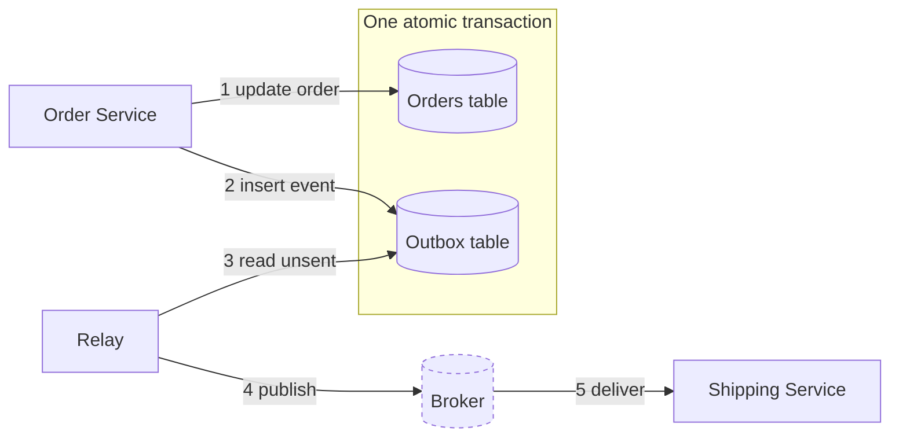

# Drawing diagrams that survive silence

**A diagram must be readable with the author gone** — the reader writes their notes from
it, not from your narration. Small beats complete: one question per diagram, ~8 nodes,
and when it grows past that you zoom to another diagram instead of growing this one.

## The rules

1. **One question per diagram.** The caption states the question it answers ("How does a
   click become a billed impression?"). A diagram answering two questions is two diagrams.

2. **Model in text first, draw once.** List the entities, states, and calls before writing
   any mermaid. Diagram-first work turns into a rewrite the moment a component is missing;
   text-first work turns into a clean board.

3. **Hard cap: ~8 nodes, ~12 edges.** At 9, split — extract the crowded cluster into its
   own diagram one level down (see the altitude ladder). Never ship a diagram the reader
   must scroll or zoom to read.

4. **Edge labels carry the verb and payload; node labels carry the role.**
   `Fetcher -->|"GET page"| Web`, never a bare arrow. An unlabeled edge makes the reader
   guess the protocol, the direction of data, or both.

5. **Name the requirement on the diagram.** A component that exists to satisfy a
   requirement says so in its label or the caption — "outbox — survives crash between
   write and publish". A box justified only in the surrounding prose fails rule 8.

6. **Mark given vs built.** External or already-provided systems get `:::ext`
   (`classDef ext stroke-dasharray:4 4` — dash only, no fill, so themes survive).
   Everything undecorated is what you propose to build. The distinction is load-bearing:
   it is the scope of the design.

7. **State machines end.** Every `stateDiagram-v2` has explicit terminal states including
   the failure terminals (`Clear`, `Sanctioned`, `InvalidID` → `[*]`). A happy-path-only
   lifecycle is half a lifecycle.

8. **Survive silence.** Final test: cover the prose and read only the diagram. If the flow
   cannot be reconstructed from it, fix the diagram, not the prose.

## Pick the type

| The question | Type |
|---|---|
| Who talks to whom (system architecture) | `flowchart TB` |
| What the user does, step by step | `flowchart LR` |
| One request's path — ordering, failures | `sequenceDiagram` |
| Lifecycle of one entity | `stateDiagram-v2` |
| Component internals — classes, ownership (LLD) | `classDiagram` |
| Component internals — runtime parts | `flowchart TB` + one `subgraph` |

This matches the site convention: distributed designs lead with a `flowchart`, low-level
katas with a `classDiagram` ([site/designs/CLAUDE.md](../../../site/designs/CLAUDE.md)).
Exact syntax and v11 gotchas: [references/syntax.md](references/syntax.md) — read it
before writing a type you have not drawn recently.

## The topology walk — the first diagram of any mechanism

When the subject is a mechanism (a pattern, a service, a pipeline), the first diagram is
always the same shape, and it answers one question: **how does the happy path cross the
components?** It is what AWS Prescriptive Guidance puts at the top of a pattern page, and
what a reader reconstructs the design from.

The recipe:

1. **Nodes are components and data stores.** Rectangles for services you build, `[( )]`
   cylinders for tables, queues and topics — the label disambiguates ("Outbox table",
   "Order events topic"). ≤9 nodes, no exceptions; past that, zoom instead.
2. **The boundary is a `subgraph`.** Draw the thing that makes the mechanism work as an
   enclosure — "One atomic transaction" wrapping the state table and the outbox table,
   "One bulkhead" wrapping a pool and its workers. If the pattern has no boundary worth
   drawing, you are drawing a flow, not a topology.
3. **Number the edges in happy-path order**: `-->|"1 write order"|`, `2`, `3`… through the
   last step. The numbers are the walk; the prose below the diagram reads as the same
   numbered steps.
4. **Happy path only.** Retries, timeouts and failure branches belong in the sequence
   diagram that follows, not on this board.



On KB pattern pages this diagram opens the `structure` block and stays untagged (every
lens sees it); the sequence diagram after it carries `data-kb-level="advanced"`.

## The altitude ladder

Zooming is a sequence of small diagrams, not one big one:

- **L0 — context.** The system as one node, plus actors and external systems. ≤5 nodes.
- **L1 — containers.** Services, stores, queues; every external call visible. This is the
  end-to-end board — draw it before any deep dive, breadth first.
- **L2 — zoom.** One L1 node's internals as its own diagram. The zoomed node keeps its
  exact L1 name: **shared names are the links between levels** — there is no other
  cross-reference mechanism.
- **L3 — dynamics.** One path as a `sequenceDiagram`, or one entity as a
  `stateDiagram-v2`.

Each level is its own diagram under the cap. Never show all levels in one picture. Draw
the next level on demand — when a reader (or an interviewer) asks, not preemptively.
Full worked example, four diagrams: [references/altitude.md](references/altitude.md).

## Visual vocabulary

| Mark | Meaning |
|---|---|
| `["Order Service"]` rectangle | component you build |
| `[("Metadata DB")]` cylinder | datastore **and** queue — the label disambiguates ("Frontier queue") |
| `:::ext` dashed border | given / external system |
| `((Actor))` or sequence `actor` | human or client actor |

Do not invent new shapes; three marks plus labels cover every architecture. A legend is a
sign the vocabulary got too big.

## Grounding from the KB

When a diagram names a pattern — outbox, DLQ, fan-out, circuit breaker — verify the
mechanism before putting the word on the board:

```
node scripts/kb.mjs find "<the symptom being solved>"
node scripts/kb.mjs get <id> --block usage
```

Use the KB's exact term as the node or edge label. A wrongly named box is worse than an
unnamed one: it ships a false claim in the most visible place on the page.

## Site pages

Target is a page under `site/`? Read
[references/site-embedding.md](references/site-embedding.md) before writing markup —
wrapper, escaping, and placement differ from plain markdown. Everywhere else (chat, docs,
artifacts) use plain ```` ```mermaid ```` fences.

## Self-check

1. Does the caption state the one question this diagram answers?
2. ≤8 nodes, ≤12 edges? If not — which cluster becomes the next level down?
3. Every edge labeled with verb or payload?
4. Given vs built distinguishable at a glance?
5. State machines: terminal states, including the failure ones?
6. Cover the prose — does the diagram survive silence?

Question 6 is the one that does the work. Run it last, every time.
